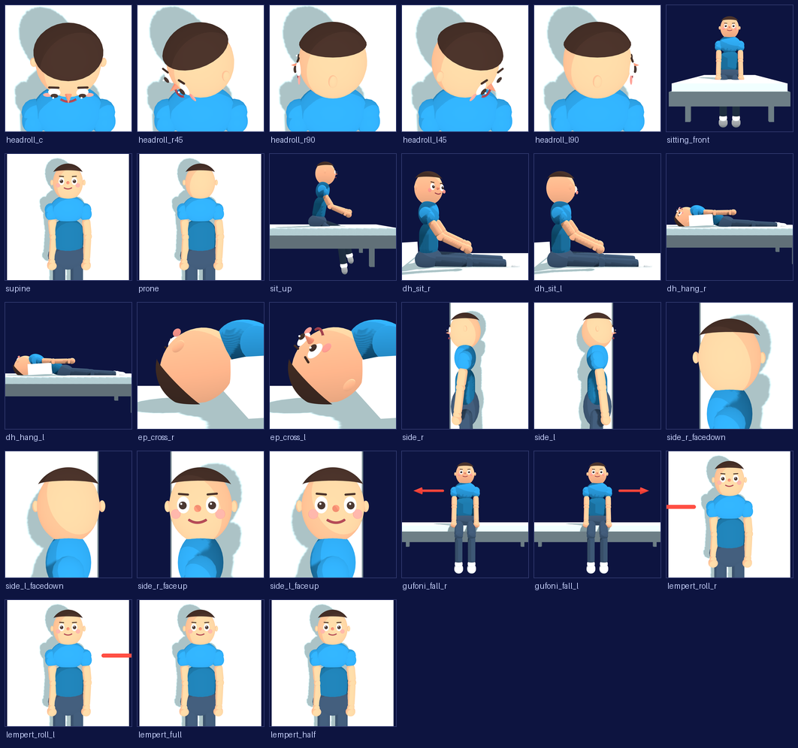

# 体位画像パイプライン 引継ぎ資料

作成日: 2026-08-21
ブランチ: `feature/pose-image-pipeline`（`main` から 21 コミット）
状態: **中断**。Task 9e まで完了、Task 10〜13 が未着手

---

## 1. この作業は何か

ゲーム本体（`src/data/poseImages.ts`）は体位イラストを **27 種**参照しているが、実ファイルは `headroll` 系の 5 枚しか存在せず、残り 22 種は「イラスト準備中」のプレースホルダが出ていた。

v7 では 3D リグから GIF を書き出したが、次の理由でゲームに載せられなかった。

1. 選択肢タイルの実表示幅は約 110px。人物が小さすぎて頭位が判別できない
2. GIF が不透明で、ゲームUI（`#0d1440` の紺）に明るい箱として浮く
3. 中間 PNG まで PWA precache に入り 4.1MB 増える
4. ポーズごとにカメラ座標を手打ちしており、肝心の頭部回旋が見えない画角になっていた

本作業は GIF をやめ、**リグから透過静止画 27 種を書き出して `public/poses/` に置く**もの。`PoseImage` / `PoseFilm` は無改造で使える。

- 設計書: [docs/superpowers/specs/2026-08-21-pose-image-pipeline-design.md](../superpowers/specs/2026-08-21-pose-image-pipeline-design.md)
- 実装計画: [docs/superpowers/plans/2026-08-21-pose-image-pipeline.md](../superpowers/plans/2026-08-21-pose-image-pipeline.md)
- 進捗レジャー: `.superpowers/sdd/2026-08-21-pose-image-pipeline/progress.md`（git 管理外）

---

## 2. 現時点の成果物



27 種すべてが 1024×1024 の透過 PNG として `public/poses/_raw/`（git 管理外）に書き出せる状態。**まだ `public/poses/` の WebP には変換していない**ので、ゲームからは見えない。

`lempert_full` / `lempert_half` が 1 コマに見えるのは正常。帯状合成は Task 10 の作業。

---

## 3. できていること

### 完了タスク

| Task | 内容 | commit |
|---|---|---|
| 1 | `src/rig/poses.ts` 抽出（純粋なポーズ数学） | `6106e0d` |
| 2 | **Gufoni の頭部反転と側臥位左右を修正** | `16ba3ef` |
| 3 | `mirrorPose` | `d67b518` |
| 4 | `src/rig/scene.ts` 抽出＋`fitCamera` | `5dede85` |
| 5 | 基本体位4種＋45°頭位2種 | `99b0c54` |
| 6 | **Lempert 手技を追加** | `f3e9938` |
| 7 | 27種の型付きカタログ | `299e81c` |
| 8 | 透過書き出しルート | `6717607` |
| 8b | 坐位ポーズを作り直し | `6c1cfa6` |
| 9 | Playwright 撮影スクリプト | `dc76946` |
| 9b〜9e | カメラ・髪・画角・矢印の修正 | `719fffb` |

各タスクは失敗するテスト → 実装 → 検証 → コミットの順で進め、すべて独立したレビューを通している。

### ファイル構成

```
src/rig/poses.ts       ポーズ数学とデータ。three の Vector3 のみ依存、React 非依存
src/rig/scene.ts       three.js のメッシュ組み立て、視点、自動フィットカメラ
src/rig/catalog.ts     PoseImageId → 撮影仕様。型で 27 種の網羅を強制
src/prototypes/ManeuverRigPrototype.tsx  レビューUI
src/prototypes/PoseExportRoute.tsx       書き出し専用ルート（透過・UIなし）
scripts/rig-ts-loader.mjs        Node から src/ の .ts を読むための resolve フック
scripts/verify_rig_geometry.mjs  幾何不変量テスト（現在 21 件）
scripts/capture_pose_images.mjs  Playwright 撮影
```

### パイプラインの回し方

```bash
npm run dev
```

別ターミナルで:

```bash
POSE_EXPORT_URL=http://localhost:5173/ node scripts/capture_pose_images.mjs
```

`33 panels captured for 27 ids` と出れば成功。`public/poses/_raw/` に PNG が出る。
一部だけ撮るときは `POSE_EXPORT_ONLY=dh_hang_r,sit_up` を付ける。

単体で見るときはブラウザで `?prototype=pose-export&id=<PoseImageId>&panel=<N>`。
リグ全体のレビューUIは `?prototype=maneuver-rig`。

検証:

```bash
node scripts/verify_rig_geometry.mjs
npm run build
```

---

## 4. 残っている作業

| Task | 内容 |
|---|---|
| 10 | `scripts/compose_pose_images.py` — 帯状合成と 512×512 WebP 変換 |
| 11 | `scripts/verify_pose_images.py` — 画像・判読性検証 |
| 12 | ゲーム統合 — `global.css` の `aspect-ratio` 1行、`vite.config.ts` の `globIgnores`、実機確認 |
| 13 | `skills/medical-maneuver-gif/` の更新 |

計画の該当セクションに、使うコードまで含めて書いてある。

**Task 12 の実機確認が最終判定になる。** 375×812 で置換法ミニゲームを開き、選択肢タイル（実質 110px）で頭位と倒す向きが判別できるかを目視で見る。1024px の書き出しで良く見えても、110px で読めなければ意味がない。

---

## 5. 未解決の問題

### 5.1 まだ直っていない見た目の問題

| 対象 | 問題 | 判断 |
|---|---|---|
| `lempert_roll_r` / `lempert_roll_l` | 矢印の三角形の先端がフレーム外に切れ、赤い棒だけが写る。向きは正しく左右逆 | 未修正。`fitCamera` が矢印の広がりを画角計算に含めていないため。修正するなら `framingPoints` に矢印の点を足す |
| `ep_cross_r` / `ep_cross_l` | 髪を狭めた副作用で、極端な寄り画角だと頭皮が広く見えて禿げて見える | 未修正。判読性は保たれている |
| `supine` / `prone` | 俯瞰でベッドが見えないため「寝ている」ように見えず、立っているようにも読める | ユーザー判断で対象外。ただし `supine` と `sitting_front` を選ばせる出題があるので、実機確認で要注意 |

### 5.2 繰り越した Minor

- 頭部フレーミングの検査が「頭から近いこと」しか見ておらず、肩の点が落ちても通る
- `PoseExportRoute` が `id` クエリの妥当性を検証していない
- three.js のジオメトリ／マテリアルをアンマウント時に破棄していない（Playwright は毎回新規ページなので実害なし）
- `gufoni_fall_l` と `gufoni_fall_r` が別手技のポーズから描かれている（幾何的には同一）

### 5.3 明示的にスコープ外

- ライブ 3D リグのゲーム内埋め込み。`renderPatient()` が毎フレーム約40個の Mesh を再生成して `dispose()` しておらず、自動再生 12 秒で JS heap が +163MB 増える
- `public/assets/` の v1〜v7 計 105MB の整理（`src/` からの参照はゼロ）
- `App.tsx` の条件付き `useReducer`（Rules of Hooks 違反）
- リグプロトタイプUIのモバイル横スクロール

---

## 6. 途中で見つかった欠陥と、その教訓

この作業で見つかった不具合は、ほぼすべて**「テストは通るが画像が間違っている」**類だった。参考になるので残す。

### 6.1 リグ本体の臨床的な誤り

- **Gufoni の頭部が 180° 反転**（`gufoni-g-down` のみ `headUp · 頸→頭 = -1.00`）。鼻の向きだけを検査していたので検出できなかった
- **側臥位が両変法とも右下**。向地性は健側＝患者左へ倒すので左肩が下でなければならない
- **Lempert の回転方向を固定していなかった**。回転を逆にして患側から先に倒す実装が全テストを通過した

### 6.2 カメラと画角

- `fitCamera` の距離計算に不要な深度パディングがあり、マージン契約を破っていた
- `framingPoints` が関節座標しか囲まず、頭部メッシュの半径（身長の約15%）が入らず頭が切れていた
- **`cranial`（頭の方から見た図）の定義を3回間違えた**。体軸沿い→頭側斜位→真上からの俯瞰。体軸に沿って見ると頭頂＝髪しか見えない
- 俯瞰では画面上方向を体軸に固定しないと、頭部回旋のコマ送りで画像全体が回転してしまう

### 6.3 矢印

- Gufoni の転倒矢印が左右とも真下を向き、2つの選択肢が見分けられなかった。倒れた後のポーズに矢印を付けていたため、肩幅軸が既に垂直に回っていた
- Lempert の回転矢印が同じ理由で潰れていた。回す前の仰臥位に付け直して解決

### 6.4 透過

- `global.css` の `body { background: var(--navy-deep) }` は Playwright の `omitBackground` では無効化されない。27 枚すべてが紺の箱になるところだった

### 6.5 計画そのものの誤り

- 画像検証の閾値を「縦横とも 55% 以上」としていたが、横長の被写体を正方形フレームに収めれば縦が余るのは幾何学的に必然で、仰臥位系がすべて落ちる。長辺 90% 以上・短辺 20% 以上に修正
- Node の ESM 解決は拡張子なしの相対 import を追えないため、`src/` のモジュールを Node から読むには resolve フックが要る

---

## 7. 再開するときに最初に読むもの

1. この資料
2. `.superpowers/sdd/2026-08-21-pose-image-pipeline/progress.md`（各タスクの完了コミットと繰り越し事項）
3. 実装計画の Task 10 以降

再開の手順は、dev サーバを立てて `node scripts/capture_pose_images.mjs` で 33 パネルを撮り直し、`node scripts/verify_rig_geometry.mjs` が 21 件通ることを確認してから Task 10 に入る。
